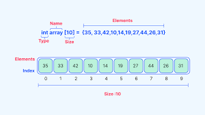

# Data Structure – Array

This repository presents a comprehensive, theory-oriented overview of the
**Array** data structure. The content is written in English and focuses on
conceptual understanding rather than programming implementation.

This material is suitable for students studying Data Structures and
Algorithms, as well as readers who want a clear and structured explanation
of arrays.

---

## Table of Contents

1. [Definition of Arrays](#1-definition-of-arrays)
2. [Characteristics and Properties](#2-characteristics-and-properties)
3. [Types of Arrays](#3-types-of-arrays)
   - [One-Dimensional Arrays](#one-dimensional-arrays)
   - [Multi-Dimensional Arrays](#multi-dimensional-arrays)
   - [Dynamic Arrays](#dynamic-arrays)
4. [Memory Layout and Indexing](#4-memory-layout-and-indexing)
5. [Common Operations on Arrays](#5-common-operations-on-arrays)
6. [Time and Space Complexity](#6-time-and-space-complexity)
7. [Advantages of Arrays](#7-advantages-of-arrays)
8. [Disadvantages of Arrays](#8-disadvantages-of-arrays)
9. [Use Cases and Applications](#9-use-cases-and-applications)
10. [Comparison with Other Data Structures](#10-comparison-with-other-data-structures)
11. [References](#11-references)

---

## 1. Definition of Arrays

An array is a linear data structure that stores a collection of elements in
contiguous memory locations. Each element is accessed using an index,
typically starting from zero.

Arrays usually store elements of the same data type, which allows direct
calculation of an element’s memory address using its index. This property
enables constant-time access to array elements.

---

## 2. Characteristics and Properties

- Arrays use contiguous memory allocation.
- All elements are homogeneous (same data type).
- Array size is fixed at creation in static arrays.
- Elements are accessed using index-based addressing.
- Random access is efficient and runs in constant time.
- Arrays provide good cache locality due to sequential memory layout.

---

## 3. Types of Arrays

### One-Dimensional Arrays
A one-dimensional array stores elements in a linear sequence. It is the
simplest form of an array and is commonly used to represent lists of data.

### Multi-Dimensional Arrays
Multi-dimensional arrays store data in more than one dimension, such as
two-dimensional arrays (rows and columns). These are often used to represent
tables, matrices, or images.

### Dynamic Arrays
Dynamic arrays can resize automatically when capacity is exceeded. They
maintain contiguous memory internally while allowing flexible growth.

---

## 4. Memory Layout and Indexing

Arrays store elements sequentially in memory. The address of an element is
calculated using the base address of the array and the index multiplied by
the size of each element.

  

  <em>Figure 1. Contiguous memory layout and indexing of an array</em>

This structure allows direct access to any element without traversing other
elements, which is one of the key advantages of arrays.

---

## 5. Common Operations on Arrays

### Traversal
Visiting each element in the array sequentially to process or inspect data.

### Access
Retrieving or updating an element using its index. This operation runs in
constant time.

### Searching
Finding a specific element in an array. In unsorted arrays, searching
requires checking elements one by one.

### Insertion
Adding a new element to the array. Insertion at the end is efficient, while
insertion at the beginning or middle requires shifting elements.

### Deletion
Removing an element from the array. Similar to insertion, deletion may
require shifting elements to maintain continuity.

---

## 6. Time and Space Complexity

- Access by index: O(1)
- Traversal: O(n)
- Search (unsorted array): O(n)
- Insertion at end: O(1) amortized
- Insertion or deletion at arbitrary positions: O(n)
- Space complexity: O(n)

Arrays are space-efficient because they require minimal additional memory
beyond the stored elements.

---

## 7. Advantages of Arrays

- Fast random access
- Efficient memory usage
- Simple and intuitive structure
- Cache-friendly due to contiguous memory
- Suitable for implementing other data structures

---

## 8. Disadvantages of Arrays

- Fixed size in static arrays
- Costly insertions and deletions in the middle
- Possible memory waste if array is underutilized
- Requires contiguous memory allocation
- Inefficient search in unsorted arrays

---

## 9. Use Cases and Applications

Arrays are widely used in computer science, including:

- Storing collections of data
- Implementing matrices and vectors
- Buffer management in systems
- Lookup tables
- Dynamic programming solutions
- Image and signal processing
- Implementing stacks and queues

---

## 10. Comparison with Other Data Structures

Compared to linked lists, arrays provide faster random access but are less
flexible for insertion and deletion. Linked lists allow efficient insertion
and deletion but require more memory and do not support direct indexing.

Arrays are ideal when fast access and memory efficiency are priorities.

---
## 11. References

1. GeeksforGeeks – Array Data Structure  
   https://www.geeksforgeeks.org/array-data-structure/

2. Stanford CS – Arrays and Memory Layout  
   https://cs.stanford.edu/people/eroberts/courses/soco/projects/1998-99/linked-lists/arrays.html

3. MIT OpenCourseWare – Introduction to Algorithms  
   https://ocw.mit.edu/courses/6-006-introduction-to-algorithms-fall-2011/

4. TutorialsPoint – Data Structures: Arrays  
   https://www.tutorialspoint.com/data_structures_algorithms/array_data_structure.htm

5. Wikipedia – Array (data structure)  
   https://en.wikipedia.org/wiki/Array_data_structure

