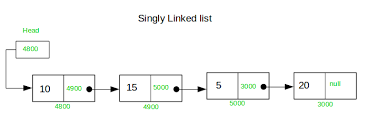

# Data Structure – Linked Lists (Theory Notes)

This repository provides a comprehensive, theory-oriented overview of **Linked Lists**.
The content focuses on conceptual understanding (no programming implementation, no code).

---

## Table of Contents

1. [Definition and Structure](#1-definition-and-structure)
2. [Types of Linked Lists](#2-types-of-linked-lists)
   - [Singly Linked List](#singly-linked-list)
   - [Doubly Linked List](#doubly-linked-list)
   - [Circular Linked List](#circular-linked-list)
   - [Other Variations](#other-variations-and-implementations)
3. [Memory Layout and Pointer Mechanics](#3-internal-memory-layout-and-pointer-mechanics)
4. [Common Operations](#4-common-operations-on-linked-lists)
5. [Time and Space Complexity](#5-time-and-space-complexity)
6. [Advantages](#6-advantages-of-linked-lists)
7. [Disadvantages](#7-disadvantages-of-linked-lists)
8. [Comparison with Arrays and Other Structures](#8-comparison-with-arrays-and-other-data-structures)
9. [Real-World Use Cases](#9-real-world-use-cases-and-applications)
10. [Common Pitfalls and Misconceptions](#10-common-pitfalls-and-misconceptions)
11. [Notes](#11-notes)

---

## 1. Definition and Structure

A **linked list** is a linear data structure composed of a sequence of elements called **nodes**.
Each node stores:
- a **data** field (payload), and
- a **reference/pointer** to another node (typically the next node in sequence).

Unlike arrays, linked list nodes are **not stored contiguously in memory**. Nodes can be scattered
across memory, and the structure is formed by pointers linking nodes together.

Key terms:
- **Head**: the first node (entry point) of the list.
- **Tail**: the last node of the list.
- **NULL / null reference**: indicates the end of a non-circular list.

Because nodes are connected by pointers rather than contiguous addresses, linked lists typically
support **dynamic growth and shrinkage** at runtime without needing a contiguous block of memory.

---

## 2. Types of Linked Lists

Linked lists come in several variations. The primary forms are:
- **Singly Linked List**
- **Doubly Linked List**
- **Circular Linked List**

### Singly Linked List

A **singly linked list** is the simplest form. Each node stores:
- data, and
- a pointer/reference to the **next** node.

Traversal is **one-directional**: from head to tail.

**Diagram (recommended):**

  

  <em>Figure 1. Singly linked list: each node points to the next node.</em>

Notes:
- The tail node’s next reference is `NULL` in a non-circular list.
- Efficient for operations near the head (e.g., insertion/deletion at the beginning).

---

### Doubly Linked List

A **doubly linked list** extends a singly list by storing two references per node:
- pointer to the **next** node
- pointer to the **previous** node

Traversal is **bidirectional** (forward and backward).

**Diagram (recommended):**

  

  <em>Figure 2. Doubly linked list: each node links to both next and previous nodes.</em>

Trade-off:
- More flexible traversal and easier deletions given a node reference
- Higher memory cost and more pointer updates per operation

---

### Circular Linked List

A **circular linked list** forms a loop:
- The tail node points back to the head node (no `NULL` termination).

Circular lists may be:
- **Circular singly** (tail.next → head)
- **Circular doubly** (tail.next → head AND head.prev → tail)

**Diagrams (recommended):**

  

  <em>Figure 3. Circular singly linked list: tail.next points back to head.</em>

  

  <em>Figure 4. Circular doubly linked list: both ends connect to form a ring.</em>

Important note:
- Traversal must include a stopping condition to avoid infinite loops.

---

### Other Variations and Implementations

**Sentinel/Header Node (Dummy Node)**  
A sentinel node is a special placeholder node (often at the head) that does not store user data.
It simplifies edge-case logic (empty list, insert/delete at head).

**Array-based simulation**  
Linked behavior can be simulated using arrays by storing “next indices” rather than pointers.
This improves locality in some contexts but conceptually remains a linked structure.

---

## 3. Internal Memory Layout and Pointer Mechanics

Linked list nodes are usually allocated independently (often on the heap).
Nodes do **not** need to occupy adjacent memory addresses.

A linked list’s order is defined by pointers:
- Each node contains a reference to another node.
- The **head pointer** is the entry point to the entire structure.
- Traversal follows pointers node-by-node.

Pointer updates are central to linked list correctness:
- Insertion requires connecting a new node into the chain.
- Deletion requires bypassing the removed node by relinking neighbors.

Performance note:
- Linked lists generally have **poorer cache locality** than arrays because nodes are scattered,
  which can cause more cache misses during traversal.

---

## 4. Common Operations on Linked Lists

### Traversal
Visiting nodes sequentially from head to tail (or until returning to head in circular lists).
Traversal is often required because there is no direct indexing.

### Searching
Searching typically requires scanning nodes one-by-one until the target is found or the list ends.
In unsorted lists, this is linear time.

### Insertion
Common insertion scenarios:
- **At head**: update new node’s next to current head; then update head.
- **At tail**: requires tail reference (or traversal to find the end).
- **At position / after a node**: locate the insertion point, then relink pointers.

Insertion is **constant-time once the position/node reference is known**, but locating a position
typically requires traversal.

### Deletion
Common deletion scenarios:
- **Remove head**: update head to head.next.
- **Remove tail**: in singly lists typically requires finding the second-to-last node.
- **Remove middle node**: requires updating neighbor pointers to bypass the target node.

Deletion is **constant-time once the node (and often its predecessor) is known**, but searching for
the node is usually linear.

---

## 5. Time and Space Complexity

Assume the list has **n** nodes.

### Time Complexity (Typical)

- Traversal: **O(n)**
- Search (unsorted): **O(n)**
- Access by index (k-th element): **O(n)** (no random access)
- Insert at head: **O(1)**
- Delete at head: **O(1)**
- Insert at tail:
  - **O(1)** if a tail pointer is maintained
  - **O(n)** otherwise (must traverse to the end)
- Delete at tail:
  - **O(1)** in doubly list with tail reference
  - **O(n)** in singly list (must find predecessor)

### Space Complexity

- Storage for nodes: **O(n)**
- Pointer overhead:
  - Singly: 1 pointer per node
  - Doubly: 2 pointers per node

---

## 6. Advantages of Linked Lists

- **Dynamic size** (grow/shrink at runtime)
- **Efficient insertions/deletions** near the head (and near known nodes)
- **No contiguous memory requirement**
- Good for building other structures (e.g., stacks, queues, adjacency lists, hash chaining)
- Stable node references (insertions elsewhere typically do not invalidate node addresses)

---

## 7. Disadvantages of Linked Lists

- **No direct/random access** (index-based access is O(n))
- **Higher memory overhead** (extra pointers per node)
- **Poor cache locality** compared to arrays
- More complex pointer management and edge cases
- Circular lists require careful traversal logic to avoid infinite loops

---

## 8. Comparison with Arrays and Other Data Structures

### Linked Lists vs Arrays

- Arrays:
  - Contiguous memory
  - O(1) index access
  - Better cache locality
  - Insert/delete in middle typically requires shifting (O(n))

- Linked Lists:
  - Non-contiguous memory
  - O(n) access by index
  - Insert/delete is pointer relinking once position is known
  - Often slower traversal in practice due to cache misses

### Related Structures

- Stacks/Queues can be implemented using arrays or linked lists.
- Hash table chaining often uses linked lists (bucket lists).
- Skip lists augment linked lists with multiple forward pointers to improve search performance.

---

## 9. Real-World Use Cases and Applications

Common applications include:
- Implementing stacks and queues
- Browser history (back/forward) using doubly linked list
- Undo/redo history in editors
- Playlists and image viewers (next/previous navigation)
- Round-robin scheduling using circular lists
- Memory allocators using free lists
- Graph adjacency lists (conceptually; some implementations use dynamic arrays instead)
- LRU cache implementations (hash map + doubly linked list)

---

## 10. Common Pitfalls and Misconceptions

- Forgetting to update pointers correctly during insertion/deletion
- Losing the head pointer during traversal (overwriting head instead of using a temporary pointer)
- Not handling empty list / single-node list edge cases
- Infinite loops in circular lists due to missing stopping condition
- Misstating complexity (“insertion is O(1)” without noting search/traversal cost)
- Memory leaks / dangling references in manual memory environments
- Modifying a list during traversal without safely managing next references

---

